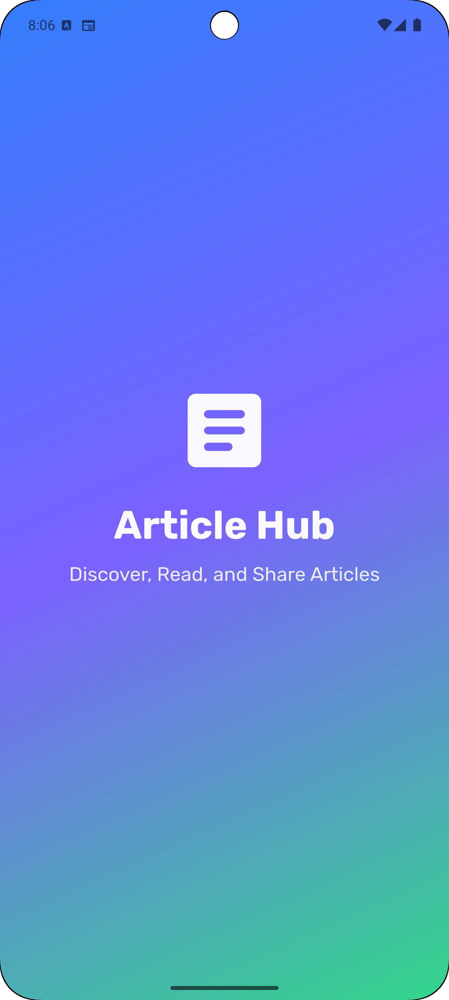

<h1>Flutter Article App</h1>

A modern Flutter application designed using Clean Architecture principles and powered by BLoC for robust state management. Users can seamlessly view, add, update, and delete articles, all within a beautiful and responsive UI.

<h2>Features</h2>
<ul>
  <li>View all articles</li>
  <li>Add new articles</li>
  <li>Edit existing articles</li>
  <li>Delete articles</li>
  <li>Clean and scalable architecture</li>
  <li>Reactive state management using BLoC</li>
  <li>Elegant and responsive UI</li>
  <li>Feedback via success and error SnackBars</li>
  <li>Offline storage using <code>shared_preferences</code></li>
</ul>

<h2>Getting Started</h2>

<h3>Clone the Repository</h3>
<pre><code>git clone https://github.com/iayr1/flutter_article_app.git
cd flutter_article_app
</code></pre>

<h3>Install Dependencies</h3>
<pre><code>flutter pub get</code></pre>

<h3>Run the App</h3>
<pre><code>flutter run</code></pre>

<h2>Project Structure</h2>
<pre><code>lib/
├── core/                 # Utilities, themes, constants
├── features/
│   └── posts/
│       ├── data/         # Data sources, models, repositories
│       ├── domain/       # Entities, use cases, abstractions
│       └── presentation/ # Blocs, events, states, UI widgets & pages
├── locator.dart          # Dependency injection setup
└── main.dart             # App entry point
</code></pre>

<h2>Tech Stack</h2>
<table>
  <tr><th>Layer</th><th>Package</th></tr>
  <tr><td>UI</td><td>Flutter SDK</td></tr>
  <tr><td>State Management</td><td>flutter_bloc</td></tr>
  <tr><td>Architecture</td><td>Clean Architecture</td></tr>
  <tr><td>Networking</td><td>http</td></tr>
  <tr><td>Dependency Injection</td><td>get_it</td></tr>
  <tr><td>Code Utilities</td><td>equatable</td></tr>
  <tr><td>Offline Storage</td><td>shared_preferences</td></tr>
</table>

<h2>State Management</h2>

This app uses the BLoC pattern (<code>flutter_bloc</code>) to handle all UI-related state changes:

<ul>
  <li>Events triggered by user interaction are passed to BLoCs.</li>
  <li>BLoCs call Use Cases to execute business logic.</li>
  <li>States are emitted in response to success or failure, updating the UI reactively.</li>
</ul>

This ensures a clear separation of concerns and maintainable, testable code.

<h2>Testing</h2>

To run unit and widget tests:

<pre><code>flutter test</code></pre>

Tests can be added to verify BLoC logic, use cases, and UI components.

<h2>Limitations / To-Do</h2>
<ul>
  <li>No pagination in article list</li>
  <li>No backend integration (ready for REST API)</li>
  <li>Authentication not yet implemented</li>
</ul>

<h2>Screenshots</h2>

<h2>Contributing</h2>

We welcome contributions! Please follow clean code practices and use meaningful naming conventions.

<h2>License</h2>

This project is licensed under the MIT License.

<strong>Made with Flutter</strong>

